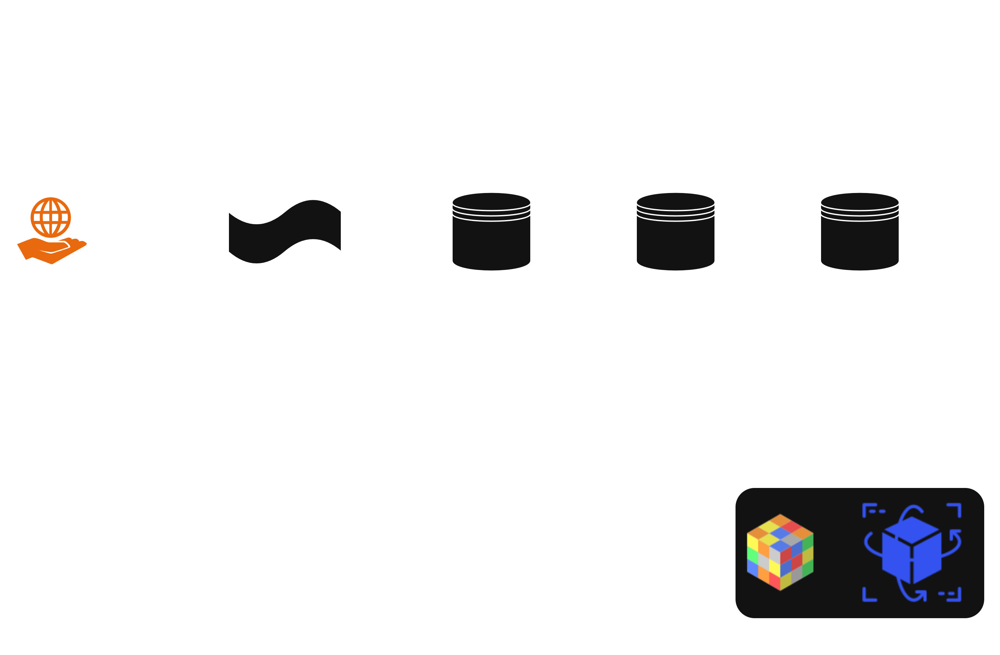

# Flight Price Model

## About

This repository implements an end-to-end machine learning and data engineering system for estimating expected flight ticket prices.

The main question answered by the model is:

> Given the characteristics of a flight and the context in which it was searched, what price should we expect for this flight?

The project currently includes:

- flight web scraping;
- event streaming with Kafka;
- PostgreSQL Medallion Architecture;
- feature engineering;
- CatBoost regression models;
- cold-start and warm-start inference;
- FastAPI model serving;
- Docker containerization;
- Kubernetes deployment with k3s;
- Traefik Ingress;
- end-to-end validation using newly scraped flights.

The current flight source is Skiplagged.

---

## Architecture



The current system architecture is:

```text
Skiplagged
    ↓
Web Scraper
    ↓
Kafka
    ↓
RAW
    ↓
SILVER
    ↓
GOLD
    ↓
Machine Learning
    ↓
CatBoost Artifacts
    ↓
FastAPI
    ↓
Docker
    ↓
k3s / Kubernetes
    ↓
Traefik Ingress
```

The deployed inference path is:

```text
Client
   ↓
Traefik
   ↓
Ingress
   ↓
Kubernetes Service
   ↓
API Pod
   ↓
FastAPI
   ↓
CatBoost
```

During local deployment, the API is available through:

```text
http://flight-api.local
```

---

## Web Scraping

The scraping layer is responsible for generating valid flight-search URLs and extracting flight information from Skiplagged.

### URL Builder

The URL Builder receives parameters such as:

- origin airport;
- destination airport;
- departure date.

Example:

```text
Origin: BSB
Destination: JTC
Date: 2026-09-18
```

Generated URL:

```text
https://skiplagged.com/flights/BSB/JTC/2026-09-18
```

The scraper extracts information such as:

- airline;
- departure time;
- arrival time;
- duration;
- number of stops;
- connection airports;
- self-transfer information;
- observed ticket price;
- search timestamp;
- ticket date.

The basic scraping flow is:

```text
Request parameters
       ↓
URL Builder
       ↓
Skiplagged URL
       ↓
Browser automation
       ↓
Raw flight information
```

Additional documentation:

[lina_doc](https://docs.google.com/document/d/1WBCA--lDNthuq8b0suJ18N2jxCPG220BMIYehpolZs8/edit?tab=t.0#heading=h.hubdlbtrjkyq)

---

## Kafka

Scraped flight events are published to the Kafka topic:

```text
raw.flights_scrapy
```

Kafka decouples scraping from database ingestion.

The consumer responsible for persisting Kafka events into PostgreSQL is:

```text
database/kafka_topic_raw_consumer.py
```

The flow is:

```text
Scraper
   ↓
Kafka Producer
   ↓
raw.flights_scrapy topic
   ↓
Kafka Consumer
   ↓
PostgreSQL RAW
```

Each raw payload receives a deterministic SHA-256 hash:

```text
data_hash
```

The hash provides idempotency and prevents duplicate raw events.

The Kafka consumer commits the Kafka offset only after the PostgreSQL transaction succeeds.

---

## Medallion Architecture

The project uses a Medallion-style architecture:

```text
RAW
 ↓
SILVER
 ↓
GOLD
```

Each layer has a different responsibility.

---

## RAW Layer

The RAW layer stores the original event received from the scraper.

Table:

```text
raw.flights_scrapy
```

Important fields include:

```text
id
data_json
data_hash
created_at
mode
```

The RAW layer preserves the original payload and provides traceability for all downstream transformations.

---

## SILVER Layer

The SILVER layer transforms raw scraper payloads into structured flight records.

Table:

```text
silver.flights_scrapy
```

The ETL is implemented in:

```text
database/etl_raw_to_silver.py
```

Examples of transformations include:

```text
Skiplagged URL
      ↓
origin
destination
ticket_date
```

and:

```text
raw_text
   ↓
duration_minutes
stops
self_transfer
connection_airports
price_original
```

Main fields include:

```text
raw_id
flight_from
flight_to
company
departure_time
arrival_time
duration_minutes
stops
self_transfer
connection_airports
price_original
currency_original
ticket_date
search_timestamp
emission_link
website
mode
```

`raw_id` preserves direct lineage back to the original RAW event.

---

## GOLD Layer

The GOLD layer contains the machine-learning-ready representation of each flight.

Table:

```text
gold.flight_price_features
```

The transformation is implemented in:

```text
database/etl_silver_to_gold.py
```

Current model features include:

### Categorical features

```text
flight_from
flight_to
route
company
```

### Numerical and binary features

```text
departure_minutes
arrival_minutes
duration_minutes
stops
self_transfer
connection_count
days_until_departure
departure_weekday
search_hour
```

Target:

```text
price_usd
```

Additional temporal variables may also be materialized in GOLD:

```text
search_weekday
departure_month
```

These variables are currently not part of the deployed V6 feature set.

Example:

```text
CNF -> MCZ
LATAM
departure: 18:00
arrival: 02:05
duration: 480 minutes
stops: 1
days until departure: 6
```

is transformed into the feature vector consumed by CatBoost.

---

## Machine Learning Problem

The current task is formulated as a supervised regression problem.

Conceptually:

```text
Flight characteristics
        +
Search context
        ↓
Feature Engineering
        ↓
Warm / Cold Routing
        ↓
CatBoost
        ↓
Expected flight price
```

The model estimates:

> The expected ticket price given the characteristics of a flight and the search context.

The model does **not** currently answer:

- Should I buy this ticket now?
- Will this ticket become cheaper tomorrow?
- What will the exact future price be?
- What is the minimum possible price for this flight?

Instead, it estimates a reference price.

This allows the application to compare:

```text
Observed market price
          vs
Model expected price
```

Example:

```text
Observed price:       USD 232.00
Model expected price: USD 312.99
Residual:             USD -80.99
```

The residual is calculated as:

```text
observed price - predicted price
```

Therefore:

```text
negative residual
      ↓
observed price below expected price
```

and:

```text
positive residual
      ↓
observed price above expected price
```

This comparison does not imply that a price will increase or decrease in the future.

It only compares the current observed value with the reference price learned by the model from historical observations with similar characteristics.

---

## Why CatBoost?

CatBoost was selected because the dataset is primarily tabular and contains several categorical variables.

It can naturally model relationships involving:

- route;
- airport;
- airline;
- booking lead time;
- duration;
- number of stops;
- departure time;
- search hour.

It also avoids the need for large one-hot encoded feature matrices.

The problem contains potentially high-cardinality categorical variables such as airport pairs and routes, making CatBoost particularly convenient for the current architecture.

---

## Warm Start and Cold Start

The production system maintains two CatBoost regression models.

```text
Incoming flight
      ↓
Is route in warm_known_routes?
      ↓
 ┌────┴────┐
yes       no
 ↓         ↓
Warm      Cold
Model     Model
```

The two models represent different generalization scenarios.

### Warm Start

Warm-start inference is used when the requested route belongs to the route universe known by the warm model during training.

The purpose of this evaluation is to answer:

> How accurately can the model estimate new observations from routes that were already represented historically?

### Cold Start

Cold-start inference is used when the exact route was not part of the warm model's known-route universe.

The purpose is to answer:

> Can the model generalize to an origin-destination pair that was not represented in the cold training route set?

The cold model must rely more heavily on patterns involving:

```text
origin
destination
airline
duration
stops
booking lead time
departure time
search context
```

rather than depending exclusively on memorizing historical prices for a specific route.

---

## Warm-Start Training Strategy

The warm model evaluates generalization to new observations of historically represented routes.

Routes with sufficient representation are selected for the warm training universe.

The current V6 warm split contains:

```text
Training:   10,831 observations
Validation:  3,009 observations
Test:        4,349 observations
```

The trained warm model contains:

```text
577 known routes
```

These routes are stored in:

```text
warm_known_routes
```

inside the model metadata.

Multiple CatBoost configurations were trained and evaluated.

Candidate configurations included:

```text
warm_depth8_baseline
warm_depth6_l2_10
warm_depth6_l2_20
warm_depth6_slow
warm_depth5_l2_15
```

Model selection is performed using validation MAE.

The selected V6 warm model was:

```text
warm_depth8_baseline
```

Validation results:

```text
Validation MAE   = 61.25 USD
Validation R²    = 0.8133
Validation MAPE  = 18.74%
Training MAE     = 28.60 USD
```

Final held-out test results:

```text
MAE   = 65.96 USD
RMSE  = 104.93 USD
R²    = 0.8018
MAPE  = 25.76%
```

The difference between training and validation error indicates some generalization gap.

However, model selection is performed on the validation partition and the final performance is measured separately on the held-out test partition.

---

## Cold-Start Training Strategy

The cold-start experiment uses a different splitting strategy.

Instead of merely separating individual observations, entire routes are held out.

Conceptually:

```text
Training routes
      ↓
CatBoost training
      ↓
Completely unseen routes
      ↓
Validation / Test
```

The current V6 cold split contains:

```text
Training:   13,596 observations
Validation:  2,825 observations
Test:        3,223 observations
```

Route distribution:

```text
Training routes:   515
Validation routes: 110
Test routes:       111
```

Sanity checks ensure that the route sets do not overlap across training, validation and test partitions.

This means that a route evaluated in the cold validation or cold test partition was not present in the cold training route set.

Multiple configurations were evaluated.

Two important candidates were:

```text
cold_route_depth8
cold_no_route_depth5_l2_15
```

Validation performance:

```text
cold_route_depth8

MAE  = 80.6460 USD
R²   = 0.7325
MAPE = 19.52%
```

and:

```text
cold_no_route_depth5_l2_15

MAE  = 80.6521 USD
R²   = 0.7188
MAPE = 19.11%
```

The validation MAE difference between these two candidates was approximately:

```text
0.006 USD
```

The current selection rule chooses the configuration with the lowest validation MAE.

Therefore, the deployed V6 cold model is:

```text
cold_route_depth8
```

Final held-out cold test results:

```text
MAE   = 66.67 USD
RMSE  = 96.86 USD
R²    = 0.7570
MAPE  = 19.98%
```

Although the selected cold model contains the `route` feature, the exact routes used in validation and testing were not present in the training route set.

The experiment therefore still evaluates generalization to unseen origin-destination pairs.

---

## Model Selection Strategy

Training, model selection and final evaluation are separated.

Conceptually:

```text
Training Set
     ↓
Train candidate models
     ↓
Validation Set
     ↓
Select configuration
with lowest validation MAE
     ↓
Test Set
     ↓
Final performance
```

The test set is not used for selecting the winning model configuration.

The warm and cold evaluations measure different problems.

```text
Warm evaluation

new observations
from historically known routes
```

versus:

```text
Cold evaluation

observations from routes
not seen during cold training
```

Therefore, warm and cold benchmark metrics should not be interpreted simply as two models competing on exactly the same prediction problem.

---

## How Warm / Cold Selection Works

The prediction service does not inspect the current GOLD table to determine whether a route is known.

Instead, the known-route list is stored inside the model metadata at training time.

Conceptually:

```text
route in warm_known_routes
        ↓
       yes
        ↓
   Warm Model
```

Otherwise:

```text
route not in warm_known_routes
        ↓
       Cold Model
```

This prevents training-serving inconsistencies.

A route that appears in the database after model training remains a cold-start route until the models are retrained.

The current V6 metadata contains:

```text
warm_known_routes
```

with:

```text
577 routes
```

---

## Important Features

The V6 models provide separate feature-importance measurements for warm-start and cold-start prediction.

### Warm Model

Current warm feature importance:

```text
days_until_departure    18.17
route                   16.30
flight_to               15.19
company                 13.19
flight_from              9.07
duration_minutes         7.29
search_hour              4.50
arrival_minutes          3.41
departure_minutes        3.33
stops                    3.10
departure_weekday        2.95
connection_count         2.28
self_transfer            1.24
```

### Cold Model

Current cold feature importance:

```text
flight_to               23.13
days_until_departure    18.94
company                 12.12
flight_from             11.33
duration_minutes         9.21
route                    8.00
arrival_minutes          3.81
search_hour              3.75
connection_count         2.64
stops                    2.54
departure_minutes        2.03
departure_weekday        1.89
self_transfer            0.62
```

One particularly important variable in both models is:

```text
days_until_departure
```

The dataset contains a substantial relationship between booking lead time and observed price.

This should be interpreted as predictive feature importance rather than as a causal conclusion.

Feature importance describes how useful a variable was for the fitted model.

It does not imply that changing that variable alone would cause a proportional change in ticket price.

---

## Model Training

Training is implemented in:

```text
ml/train_model.py
```

The current V6 training procedure generates:

```text
ml/models/flight_price_catboost_warm_v6.cbm
ml/models/flight_price_catboost_cold_v6.cbm
ml/models/flight_price_catboost_v6_metadata.joblib
```

The metadata artifact stores the information required to keep training and serving behavior consistent.

Current metadata fields include:

```text
version
selection_rule
target

warm_features
warm_categorical_features
warm_known_routes
warm_experiment
warm_feature_importance
warm_test_metrics

cold_features
cold_categorical_features
cold_experiment
cold_feature_importance
cold_test_metrics

numeric_features
```

Warm and cold models are allowed to use different feature configurations.

For this reason, the inference layer obtains feature definitions directly from the training metadata.

---

## Model Serving

Inference logic is implemented in:

```text
ml/predict.py
```

The prediction layer:

1. receives business-level flight information;
2. recreates the same model features used during training;
3. creates the origin-destination route;
4. determines whether the route belongs to `warm_known_routes`;
5. selects the corresponding warm or cold model;
6. uses the feature list stored for that model;
7. returns the predicted price and model metadata.

Conceptually:

```python
if route in warm_known_routes:
    model = warm_model
    features = warm_features
else:
    model = cold_model
    features = cold_features
```

This prevents feature transformation logic from being duplicated inside the API layer and keeps inference consistent with training.

---

## FastAPI

The model is exposed through FastAPI.

Main endpoint:

```text
POST /predict
```

Health endpoint:

```text
GET /health
```

Example request:

```json
{
  "flight_from": "CNF",
  "flight_to": "MCZ",
  "company": "LATAM",
  "departure_time": "18:00",
  "arrival_time": "02:05",
  "duration_minutes": 480,
  "stops": 1,
  "self_transfer": false,
  "connection_airports": ["GRU"],
  "ticket_date": "2026-09-22",
  "search_timestamp": "2026-09-16 21:07:31"
}
```

Example response:

```json
{
  "predicted_price_usd": 382.74,
  "route": "CNF_MCZ",
  "route_known": true,
  "model_used": "warm",
  "expected_mae_usd": 65.96
}
```

`expected_mae_usd` is the aggregate benchmark MAE obtained on the held-out test set for the selected model.

It should not be interpreted as a formal confidence interval or prediction interval.

---

## Docker

The inference application is containerized.

Current production image:

```text
flight-price-api:v6
```

The inference container contains:

```text
FastAPI
predict.py
CatBoost warm artifact
CatBoost cold artifact
V6 metadata
```

Training is intentionally separated from the serving container.

The deployed Kubernetes image is:

```text
docker.io/library/flight-price-api:v6
```

---

## Kubernetes / k3s

The inference API is deployed using k3s, a lightweight Kubernetes distribution.

The deployment currently contains two API replicas.

```text
Traefik
   ↓
Ingress
   ↓
flight-price-api Service
   ↓
Pod 1
Pod 2
```

The Kubernetes configuration is stored under:

```text
k8s/
```

including:

```text
deployment.yaml
service.yaml
ingress.yaml
```

The deployment includes:

- two replicas;
- liveness probe;
- readiness probe;
- CPU requests and limits;
- memory requests and limits.

The k3s data directory is configured outside the system root partition:

```text
/mnt/armazenamento/k3s
```

The V6 deployment was validated with both replicas running successfully:

```text
READY   STATUS
1/1     Running
1/1     Running
```

---

## Ingress

Traefik acts as the Kubernetes Ingress Controller.

The API can currently be accessed through:

```text
http://flight-api.local
```

Example:

```bash
curl http://flight-api.local/health
```

Expected response:

```json
{
  "status": "ok"
}
```

The inference flow is therefore:

```text
Client
   ↓
flight-api.local
   ↓
Traefik
   ↓
Ingress
   ↓
Kubernetes Service
   ↓
API Pod
   ↓
FastAPI
   ↓
CatBoost V6
```

No `kubectl port-forward` is required for normal local access.

---

## End-to-End Test

The repository contains:

```text
test_pipeline_real.py
```

This script validates the entire architecture using newly scraped live data.

A single command:

```bash
python test_pipeline_real.py
```

executes:

```text
Skiplagged
    ↓
Web Scraper
    ↓
Kafka Producer
    ↓
Kafka Topic
    ↓
Kafka Consumer
    ↓
RAW
    ↓
SILVER
    ↓
GOLD
    ↓
Traefik Ingress
    ↓
FastAPI
    ↓
CatBoost V6
```

The test calculates the same SHA-256 hash used by the Kafka consumer and tracks the exact events generated during the execution.

This allows the system to verify that the same flight record successfully propagated through all pipeline layers.

The validation therefore checks not only model inference but also:

```text
data collection
+
event delivery
+
database persistence
+
feature engineering
+
production inference
```

---

## End-to-End Production Example

A real end-to-end execution was performed on September 26, 2026.

Flight:

```text
Route: BSB -> CNF
Company: Azul Linhas Aereas
Departure: 05:35
Arrival: 06:55
Duration: 60 minutes
Stops: 0
Booking lead time: 3 days
```

The scraper found:

```text
7 flights
```

The generated events successfully traveled through:

```text
Kafka
 ↓
RAW
 ↓
SILVER
 ↓
GOLD
 ↓
Production API
```

For one tracked flight:

```text
RAW ID:
39c55cb2-e7a8-43af-b35d-a6111ec7406a
```

The observed result was:

```text
Observed price:       USD 232.00
Model expected price: USD 312.99

Residual:             USD -80.99
Absolute error:       USD 80.99
```

Inference metadata:

```text
Model:                warm
Route known:          true
Warm benchmark MAE:   USD 65.96
```

The model therefore classified the observation as:

```text
BELOW EXPECTED
```

because:

```text
232.00 < 312.99
```

The interpretation is:

> The currently observed market price is below the expected reference value learned by the model for flights with similar characteristics.

This does **not** mean that the ticket price will necessarily increase later.

The model estimates expected price, not future price direction.

---

## Current Dataset

The current GOLD dataset contains approximately:

```text
19,650 flight observations
736 routes
4 airline categories
```

The currently observed booking horizon is:

```text
days_until_departure = 0 to 60 days
```

The dataset therefore contains observations ranging from flights searched on the day of departure to flights searched approximately two months before departure.

An important distinction is:

```text
booking horizon
!=
historical temporal depth
```

For example:

```text
search today
for a flight departing in 60 days
```

provides a large booking lead time.

However, it does not provide a 60-day historical price trajectory for that route.

The current dataset is appropriate for the existing expected-price regression problem.

The principal remaining data limitation is the amount of repeated observation of the same routes across longer calendar periods.

---

## Model Validation

The V6 training procedure separates:

```text
training
validation
test
```

Candidate model configurations are trained using the training partition.

The validation partition is used to select the winning configuration.

The test partition is reserved for final evaluation.

### Warm validation

The warm experiment evaluates new observations from historically represented routes.

Final test performance:

```text
MAE   = 65.96 USD
RMSE  = 104.93 USD
R²    = 0.8018
MAPE  = 25.76%
```

### Cold validation

The cold experiment holds entire routes outside the training route universe.

Final test performance:

```text
MAE   = 66.67 USD
RMSE  = 96.86 USD
R²    = 0.7570
MAPE  = 19.98%
```

The purpose of the cold experiment is not to outperform the warm model.

It tests a different question:

> How well does the system generalize when the exact origin-destination pair was not seen during training?

The warm experiment instead evaluates:

> How well does the system predict new observations from routes already represented historically?

---

## Current Limitations

The current model estimates expected market price from flight characteristics and search context.

Its primary limitation is **historical temporal depth**.

Although the dataset contains almost 20,000 observations and booking horizons between 0 and 60 days, most routes have not yet been repeatedly observed across a long calendar period.

Therefore, the current system should not be interpreted as a temporal forecasting model.

It does not currently model the full historical trajectory:

```text
price at t-3
price at t-2
price at t-1
price at t
```

for the same flight or route over extended periods.

The current model predicts:

```text
Expected price
given current flight/search characteristics
```

rather than:

```text
Future price direction
```

---

## Future Work

The main future improvement is to increase **temporal depth**.

Future data collection should repeatedly observe a fixed set of routes across time.

Conceptually:

```text
Route A
  ↓
Search on day t
  ↓
Search on day t + 1
  ↓
Search on day t + 2
  ↓
Search on day t + 3
  ↓
...
```

This would produce historical price trajectories instead of isolated search snapshots.

With sufficient temporal depth, a future modeling stage could investigate:

```text
historical price movement
rolling price statistics
recent price trend
price acceleration
route-level temporal behavior
```

and eventually formulate a separate problem such as:

```text
Will the flight price increase,
decrease,
or remain approximately stable?
```

This should be treated as a separate machine-learning problem from the current model.

The current project estimates:

```text
E[price | flight characteristics, search context]
```

while a future temporally deep model could investigate:

```text
future price behavior
given historical price trajectory
```

Therefore, temporal depth is an extension of the current architecture rather than a requirement for the existing expected-price model.